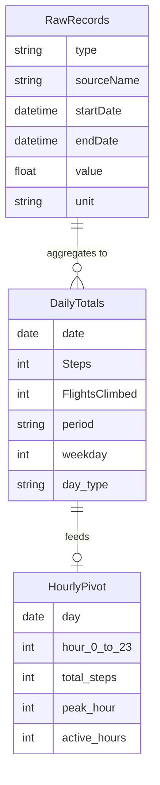

# 2025 Health Data Analysis

---

## Executive Summary

This project analyzes a full year of Apple Health step data to quantify how daily activity shifts across the academic calendar and whether routine leaves a learnable signal in the data. **Fall semester** produced the highest average daily steps (**9,163**), **Summer break** the lowest (**7,580**), with **Spring semester** in between (**7,398**). A **Gradient Boosting classifier** predicted weekday vs. weekend from hourly step patterns with **84% accuracy** and **AUC 0.82**, outperforming a baseline by 10 percentage points. **Next-day step forecasting** achieved only **R² ≈ 0.07**, showing that daily *patterns* are predictable while daily *volume* is not. The so-what: structure (semesters, weekdays) drives both step levels and discriminative hourly profiles; without that structure, activity and predictability drop.

---

## Project Background

Understanding how daily movement varies with life context supports better health planning and goal-setting. For individuals whose schedules are tied to academic or work calendars, step data can reveal whether activity is consistently higher during structured periods (e.g., semesters) and lower during breaks, and whether weekday and weekend behavior are distinguishable. Quantifying these patterns helps set realistic targets and identify when intervention or habit-building may be most impactful.

This project uses **365 days** of iPhone step data exported from the Apple Health app to answer three questions: how daily activity shifts across **Spring semester** (Jan–May), **Summer break** (Jun–Jul), and **Fall semester** (Aug–Dec); whether weekday and weekend step distributions are statistically distinguishable and whether a machine learning model can classify day type from hourly profiles alone; and whether next-day step count can be predicted from recent walking history. The analysis progresses from exploratory visualization and summary statistics to hypothesis testing, supervised classification, and time series forecasting.

The work is framed around a single user (university student) and a single year, but the methodology and findings are relevant to any setting where calendar-driven routine is expected to influence activity. The contrast between strong classification performance and weak forecasting performance is a central takeaway: **structure is learnable; volume is not.**

---

## Data Structure & ERD

The analysis uses one primary data source: an **Apple Health export** (`export.xml`), which is stream-parsed and filtered to the calendar year 2025 and to records from a single source device. After filtering, the pipeline produces the following logical entities:

| Table / Concept | Description | Key Columns |
|-----------------|-------------|-------------|
| **Raw records** | One row per HealthKit sample | `type`, `sourceName`, `startDate`, `endDate`, `value`, `unit` |
| **Daily totals** | One row per calendar day | `date`, `Steps`, `FlightsClimbed`, `period`, `weekday`, `day_type` (weekday/weekend) |
| **Hourly pivot** | Steps by day and hour (for classification) | `day`, `hour_0` … `hour_23`, derived `total_steps`, `peak_hour`, `active_hours` |

- **type:** e.g. `HKQuantityTypeIdentifierStepCount`; analysis uses step count only.  
- **startDate / endDate:** Timestamp of the sample; used to assign `date` and `hour`.  
- **value:** Numeric quantity (steps per sample).  
- **period:** Derived from date — Spring Semester (Jan–May), Summer Break (Jun–Jul), Fall Semester (Aug–Dec).  
- **day_type:** Derived from `weekday` — weekday (Mon–Fri) vs. weekend (Sat–Sun).

Conceptual data flow (raw → daily → hourly):



---

## Insights Deep Dive

### Activity by Academic Period

| Period | Days | Mean steps | Median steps | Min | Max |
|--------|------|------------|--------------|-----|-----|
| Spring Semester | 151 | 7,398 | 7,403 | 96 | 25,512 |
| Summer Break | 61 | 7,580 | 7,250 | 788 | 20,300 |
| Fall Semester | 153 | **9,163** | **9,330** | 136 | 21,137 |

**Metric:** Fall semester mean daily steps are **~24% higher** than Spring and **~21% higher** than Summer.

**Narrative:** Daily step counts align with the academic calendar. Fall semester shows a clear step premium, consistent with a campus that requires more walking between buildings. Spring is moderate; Summer establishes a lower, less structured baseline. Rolling 7- and 30-day averages make the ramp-up at semester start and the drop into breaks visually clear. The “so what” is that **environment and schedule drive step volume** in a consistent, measurable way.


---

### Weekday vs. Weekend Patterns

**Metric:** Weekday vs. weekend separation in mean steps is **largest during Fall semester** and **smallest during Summer break**; Mann-Whitney U tests did not reach significance at α = 0.05 in any single period, consistent with high day-to-day variability.

**Narrative:** Day-of-week box plots show higher median steps on weekdays (especially mid-week) than on weekends during semesters. The weekday/weekend gap is most pronounced in Fall and nearly absent in Summer, when no fixed schedule differentiates days. Hourly profiles show weekday peaks at **9 AM, 5–6 PM, and 10 PM** (class and commute times) and flatter, lower weekend curves. During Summer, weekday and weekend hourly profiles overlap. This period-dependent separation is the signal the classification model exploits in semesters and loses in Summer.


---

### Weekday vs. Weekend Classification

**Metric:** **Gradient Boosting** achieved **84% accuracy** and **AUC 0.82** on a held-out December test set (23 weekdays, 8 weekends), vs. a majority-class baseline of **74%**.

**Narrative:** Using 27 features (24 hourly step counts plus total steps, peak hour, and active hours), the classifier learned discriminative structure: the most important hours were **5 PM, 6 PM, 10 PM, and 9 AM** — times when a school-day schedule diverges most from unstructured rest. December was chosen deliberately as a hard test set (winter break blurs weekday/weekend), so the model’s confusion on some weekends reflects reality rather than a flaw. The 10-point lift over baseline indicates the model captured genuine pattern, not class imbalance.


---

### Next-Day Step Forecasting

**Metric:** **Linear Regression** with lag and rolling features achieved **R² ≈ 0.07** on the December test set; Gradient Boosting performed worse (negative R²).

**Narrative:** Predictions cluster near the mean (roughly 7,000–8,000 steps) while actual daily steps range from about 2,000 to 18,000. Daily *volume* depends on many unobserved factors (weather, plans, errands) and is not reliably predictable from step history alone. The takeaway: **hourly pattern** (when you move) is learnable; **daily magnitude** (how much you move) is not, from this feature set. The contrast with classification is itself an insight.


---

## Recommendations

1. **Use period-aware goals.** Set step targets by period (e.g., higher in Fall, lower in Summer) rather than a single annual target, to match observed structure and avoid discouragement in low-structure periods.

2. **Treat weekday vs. weekend as a design lever.** Where the goal is to increase activity, focus on weekend and break periods where the data show the largest gap versus weekdays and the least discriminative structure.

3. **Rely on patterns, not point forecasts.** Use hourly or daily *patterns* (e.g., “weekday-like” vs. “weekend-like”) for insights or nudges; avoid relying on next-day step predictions for individual daily targets.

4. **Extend with more signals.** Incorporate heart rate, sleep, or workout data from the same export to improve classification and to explore whether volume becomes more predictable with additional context.

---

## Caveats & Assumptions

- **Single metric, single year, single user.** Conclusions are specific to 2025 and to the individual’s schedules and campuses; generalizability to other years or populations is untested.

- **December as holdout.** The classifier and forecast are evaluated on December (including winter break). This is a conservative, “hard” test; a mid-semester holdout would likely show higher accuracy but would miss the break-period behavior.

- **Apple Health as source of truth.** Step counts are taken from the iPhone export as-is; no independent validation of device accuracy or completeness (e.g., phone not carried) is applied.

---

## Technical Implementation

Analysis is implemented in a single Jupyter notebook. Technical details (XML stream parsing, feature engineering, train/test splits, and model choices) are documented in the notebook itself. For replication:

| Asset | Description |
|-------|-------------|
| **Notebook** | `health_data_2025.ipynb` — load and filter data, daily aggregation, period definitions, visualizations, Mann-Whitney U tests, hourly feature construction, classification (Logistic Regression, Random Forest, Gradient Boosting), and next-day regression. |
| **Dependencies** | `requirements.txt` — Python 3.12, pandas, NumPy, matplotlib, scikit-learn, SciPy. |
| **Data** | Place Apple Health `export.xml` in a `data/` folder at project root; the notebook filters to 2025 and a single source device. |

**How to run:** Clone the repository, install with `pip install -r requirements.txt`, add `data/export.xml`, and run all cells in `health_data_2025.ipynb`.

```
2025-health-analysis/
├── health_data_2025.ipynb
├── requirements.txt
├── .gitignore
├── README.md
└── data/
    └── export.xml          # Not tracked; user-provided
```

The raw `export.xml` file is not included in the repository due to size and privacy. The notebook is designed to work with any Apple Health export that follows the same XML schema.
